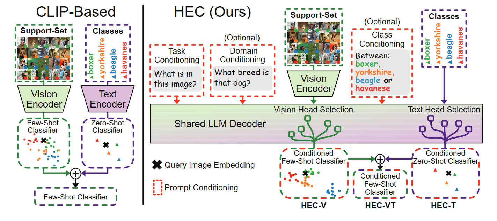

<div align="center">

<h1>🔓 Unlocking Few-Shot Capabilities in LVLMs via Prompt Conditioning and Head Selection</h1>
<h3> ECCV 2026 </h3>
<a href="https://arxiv.org/abs/2603.24181"></a>
<a href="https://adhemardesenneville.github.io/HEC/"></a>

**[ENS Paris-Saclay, Centre Borelli](https://centreborelli.ens-paris-saclay.fr/fr)**; **[École Polytechnique, AMIAD](https://www.defense.gouv.fr/amiad-agence-ia-defense)**; **[Institut Universitaire de France](https://www.iufrance.fr/)**

[Adhemar de Senneville](https://adhemardesenneville.github.io/), [Xavier Bou](https://xavibou.github.io/), [Jérémy Anger](https://scholar.google.com/citations?user=tM5-UCsAAAAJ&hl=en), [Rafael Grompone](https://scholar.google.com/citations?user=GLovf4UAAAAJ&hl=en), [Gabriele Facciolo](http://gfacciol.github.io/)

</div>



## 📖 Overview

**Head Ensemble Classifiers (HEC)** is a training-free unified framework for few-shot and zero-shot image classification. 

- `HEC-V`: few-shot classifier with selected vision-heads.
- `HEC-T`: zero-shot classifier with selected text-heads.
- `HEC-VT`: vision-text few-shot classifier by combining `HEC-V` and `HEC-T`.

## ⚙️ Installation

```bash
git clone https://github.com/AdhemarDeSenneville/HEC
cd HEC

conda create -n hec python=3.11
conda activate hec

pip install -r requirements.txt

# Optional: only needed for CUB-200 / Traffic-Signs through Meta-Dataset.
pip install -r requirements-meta.txt
```

## 🗂️ Datasets

The paper evaluates on image-classification datasets including:

### CLIP-Style Datasets

Prepare these datasets following the Tip-Adapter setup:
[DATASET.md](https://github.com/gaopengcuhk/Tip-Adapter/blob/main/DATASET.md).

- EuroSAT
- UCF101
- DTD
- Caltech101
- SUN397
- OxfordPets
- StanfordCars
- Flowers102
- Food101
- FGVC-Aircraft

To evaluate only these datasets, use `dataset=CLIP_4S`.

### Meta-Dataset Datasets

Prepare these datasets following the Meta-Dataset setup:
[Meta-Dataset](https://github.com/google-research/meta-dataset).

Note: the Meta-Dataset installation is deprecated and requires TensorFlow. If needed,
we are open to updating this code path to remove the direct Meta-Dataset dependency.

- CUB-200
- Traffic-Signs

To evaluate only these datasets, use `dataset=META_4S`.

### CLIP-Style and Meta-Dataset

To evaluate all datasets together, use `dataset=FULL_4S`.


## 🚀 Usage

### Vision Few-Shot: HEC-V

When class names are unknown and only a labeled support set is available.

<!-- BASE + "logs/_fewshot_jz/table_VT/HEC_V/02-27/20-01-02",  # QWEN (HEC-V) -->

```bash
python -m eval \
  backbone=QWENv2 \ # or LLaVA_OV or your own implemented model
  backbone.output_llm_lasttok_heads=True \ # Hook attention head distributions
  classifier=HEC_V \ # or PROBING or SAVs
  prompt=TD \ # Prompt with Domain conditioning
  dataset=FULL_4S \ # 4-shot 
  dataset.n_tuning_task=0 \ # HEC-V does not need per dataset tuning!
  dataset.n_task=5 \
  server=jz \ # path configuration (create your own from example)
  task_name=table_vision_few_shot \ # output task folder
  sub_task_name=HEC_V \ # output exp folder
  -m
```

### Text Zero-Shot: HEC-T

<!-- # BASE + "logs/_fewshot_jz/zero_eval/llava_HEC_T/02-26/23-26-18" -->
<!-- # BASE + "logs/_fewshot_jz/zero_eval/qwen_HEC_T/02-26/22-14-19" -->

When only class names are available.

```bash
python -m eval \
 backbone=QWENv2,LLaVA_OV  \  # Eval both models
 backbone.output_llm_lasttok_heads=True \
 classifier=HEC_T \ 
 +classifier.context=Task \ # Use same heads on all datasets (Task text-heads)
 prompt=TDC \ # Prompt with Class conditioning
 dataset=FULL_4S10W \ # 10-way 4-shot
 dataset.n_task=100 \
 dataset.n_tuning_task=0 \ # HEC-T does not need per dataset tuning!
 server=jz \
 task_name=table_text_zero_shot \
 sub_task_name=HEC_T \ 
 -m
```

### Vision-Text Few-Shot: HEC-VT

Use this when both class names and a labeled support set are available.

<!-- BASE + "logs/_fewshot_jz/table_VT/HEC_VT/02-27/20-02-07", # QWEN (HEC-VT) F -->
<!-- BASE + "logs/_fewshot_jz/table_VT/DFN_1/02-26/22-48-05/3" -->

```bash
python -m eval \
  backbone=QWENv2 \
  backbone.output_llm_lasttok_heads=True \
  classifier=HEC_VT \
  prompt=TD \ # Prompt with Domain conditioning 
  dataset=FULL_4S \ # 4-shot
  dataset.n_tuning_task=1 \ # Per dataset Tuning
  dataset.n_task=5 \
  server=jz \
  task_name=table_vision_text_few_shot \
  sub_task_name=HEC_VT \
  -m
```


## Citation

```bibtex
@misc{desenneville2026unlockingfewshotcapabilitieslvlms,
  title = {Unlocking Few-Shot Capabilities in {LVLMs} via Prompt Conditioning and Head Selection},
  author = {de Senneville, Adhemar and Bou, Xavier and Anger, J{\'e}r{\'e}my and Grompone, Rafael and Facciolo, Gabriele},
  year = {2026},
  eprint = {2603.24181},
  archivePrefix = {arXiv},
  primaryClass = {cs.CV},
  doi = {10.48550/arXiv.2603.24181},
  url = {https://arxiv.org/abs/2603.24181}
}
```
